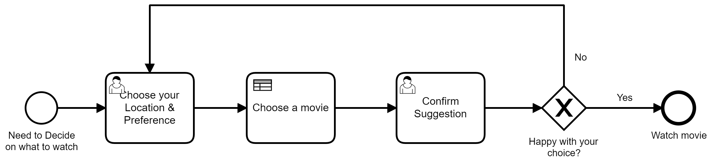
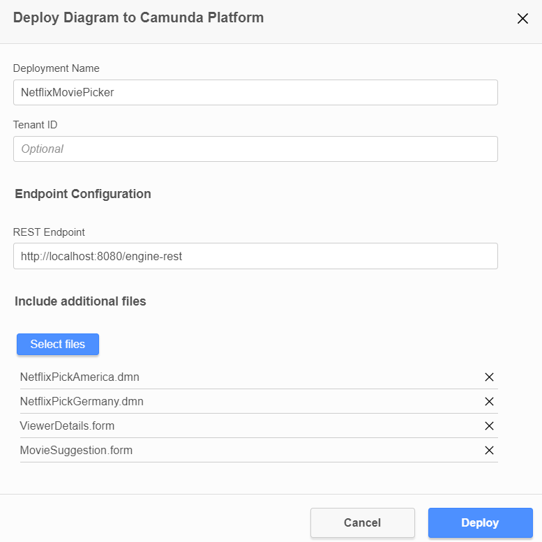

# Dynamically Call a DMN table from a BPMN Process
This is a Camunda example which shows how a BPMN model can dynamically call a different DMN table depending on runtime data.

## What does this do?
There is a BPMN process in which a user can give some data about themselves and the kind of movie they're interested in watching and using DMN a suggestion is made to them.

There are 2 DMN tables with the keys `netflixPickGermany`and `netflixPickAmerica`. The DMN table that is called Depends on if a user has selected `America` or `Germany`as their location.
This is done by creating a variable `country`from a use form and then using an expression when calling the DMN table. `netflixPick#{country}`. This will generate the correct name of the table in runtime. 

## How to Run this?
1. Install [Java JDK 11](https://www.oracle.com/java/technologies/javase-jdk11-downloads.html) (if you don't already have it)
1. Download and run [Camunda Platform](https://camunda.com/download/)
1. Download and run the [Camunda Modeler](https://camunda.com/download/modeler/)  
1. Open the model in the BPMN folder in the Modeler
1. Deploy the BPMN making sure to include all DMN and forum files. 

1. Go to `http://localhost:8080` and login using demo/demo
1. Start the `Netflix Movie Picker` process. 